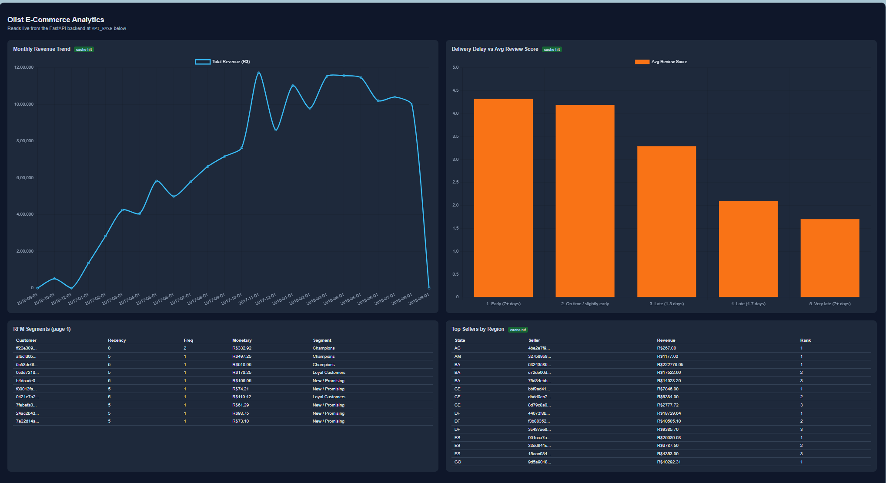
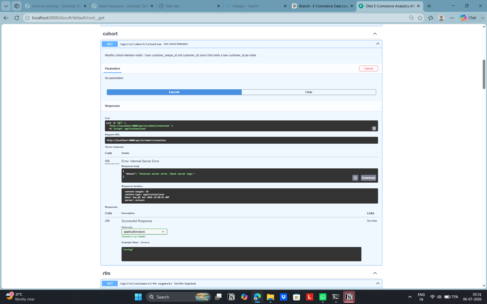
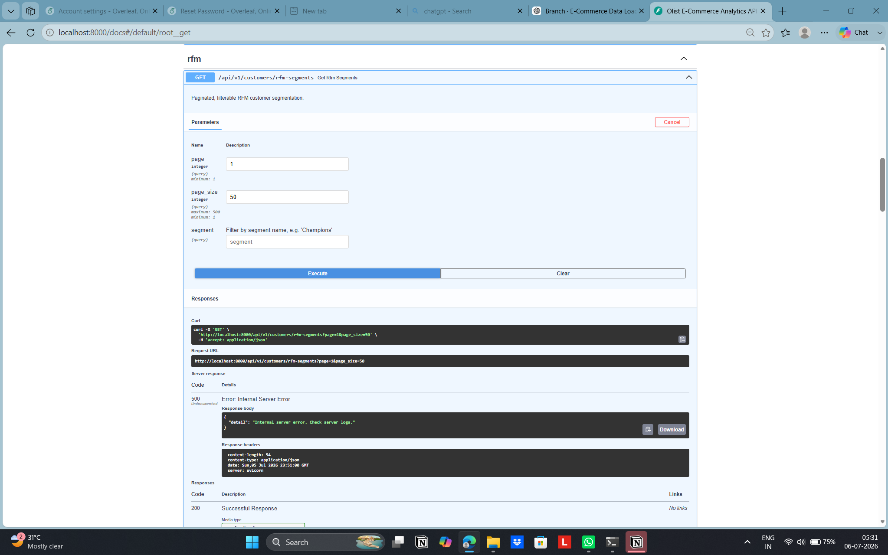
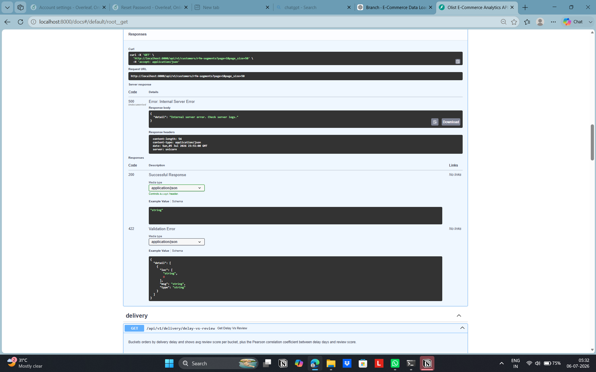
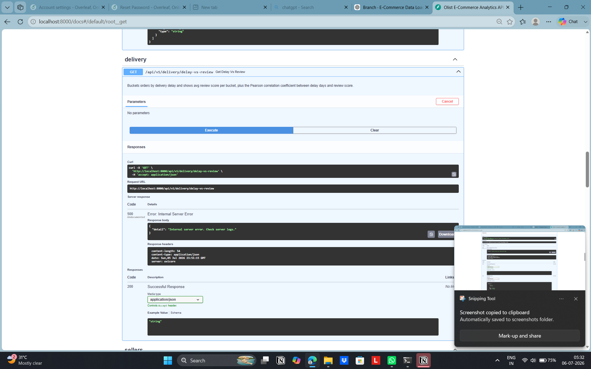

# E-Commerce Sales Analytics Platform

An end-to-end business intelligence platform built using **PostgreSQL, FastAPI, Redis, Docker, and Python** to process and analyze the **Olist Brazilian E-Commerce Dataset**. The platform ingests raw CSV data through an automated ETL pipeline, performs advanced SQL analytics, exposes REST APIs, and visualizes business insights through an interactive dashboard.

---

## Dashboard



---

## API Documentation

### Revenue & Cohort Analytics



### Customer & Seller Analytics





### Delivery Analytics


---

# Features

- Automated ETL pipeline for loading **1.18M+ records** from the Olist dataset into PostgreSQL
- Normalized PostgreSQL schema comprising **9 relational tables**
- Advanced analytical SQL using **CTEs, JOINs, aggregations, CASE statements, DATE_TRUNC, window functions, and ranking functions**
- Customer **RFM segmentation**
- Customer **cohort retention analysis**
- Revenue trend analysis with rolling averages and month-over-month growth
- Seller performance and regional product analytics
- Delivery delay vs customer review analysis
- FastAPI backend exposing **6+ REST APIs**
- Redis-backed caching for expensive analytical queries
- Interactive Chart.js dashboard
- Dockerized development environment

---

# Performance Benchmark

Redis caching was benchmarked using repeated requests to analytical endpoints.

| Benchmark | Result |
|-----------|--------:|
| Cached API Response | **13.2 ms** |
| Uncached API Response | **210.1 ms** |
| Latency Reduction | **93.7% (~16× faster)** |

---

# System Architecture

```
                    Olist CSV Dataset
                           │
                           ▼
                  Python ETL Pipeline
                    (Pandas Loader)
                           │
                           ▼
                 PostgreSQL Database
                  (9 Normalized Tables)
                           │
                  SQLAlchemy Connection
                           │
                           ▼
                   FastAPI REST APIs
                  /api/v1/...
                           │
              ┌────────────┴────────────┐
              ▼                         ▼
        Redis Cache              Business Logic
              │                         │
              └────────────┬────────────┘
                           ▼
                Chart.js Dashboard
```

---

# Technology Stack

| Category | Technologies |
|----------|--------------|
| Backend | FastAPI, Python |
| Database | PostgreSQL |
| ORM / DB Access | SQLAlchemy |
| Caching | Redis |
| Data Processing | Pandas |
| Frontend | HTML, CSS, JavaScript, Chart.js |
| Containerization | Docker, Docker Compose |

---

# Database Schema

The project uses a normalized relational schema consisting of:

- Customers
- Orders
- Order Items
- Products
- Sellers
- Payments
- Reviews
- Geolocation
- Product Category Translation

Primary keys, foreign keys, and indexes are used to maintain referential integrity and optimize analytical queries.

---

# Key Design Decisions

### Why `customer_unique_id` instead of `customer_id`?

The Olist dataset generates a new `customer_id` for every purchase. Cohort retention and RFM segmentation therefore use `customer_unique_id` to correctly identify repeat customers. Using `customer_id` would incorrectly classify every purchase as coming from a new customer.

---

### Why Raw SQL?

This project focuses on analytical SQL rather than CRUD operations. Complex window functions, CTEs, ranking, cohort analysis, and RFM segmentation are more naturally expressed in SQL than through an ORM. SQLAlchemy is used for connection pooling and parameterized query execution.

---

### Why Redis?

Several endpoints perform full-table aggregations and window-function computations. Redis caches these expensive results, avoiding repeated execution and reducing average response latency by approximately **94%**.

---

# API Endpoints

| Endpoint | Description |
|----------|-------------|
| GET `/api/v1/revenue/trends` | Monthly revenue trends |
| GET `/api/v1/cohort/retention` | Customer cohort retention |
| GET `/api/v1/customers/rfm-segments` | Customer RFM segmentation |
| GET `/api/v1/sellers/top-by-region` | Top sellers by state |
| GET `/api/v1/products/top-categories-by-region` | Best-selling categories |
| GET `/api/v1/delivery/delay-vs-review` | Delivery delay vs customer review analysis |
| GET `/health` | Health check |

---

# Installation

```bash
git clone https://github.com/thediyagupta/E-Commerce-Sales-Analytics-Platform.git

cd E-Commerce-Sales-Analytics-Platform

docker compose up -d

pip install -r requirements.txt

# Download the Olist dataset from Kaggle and place the CSV files in /data

python load_data.py

cp .env.example .env

uvicorn app.main:app --reload
```

API Documentation

```
http://localhost:8000/docs
```

---

# Repository Structure

```
├── app/
│   ├── routers/
│   ├── cache.py
│   ├── config.py
│   ├── database.py
│   └── main.py
│
├── assets/
├── frontend/
├── sql/
├── data/
│
├── docker-compose.yml
├── schema.sql
├── load_data.py
├── requirements.txt
└── README.md
```

---

# Future Improvements

- Deploy the platform on Render with managed PostgreSQL and Redis
- Materialized views for frequently accessed analytical queries
- JWT-based authentication
- CI/CD pipeline using GitHub Actions
- Kubernetes deployment
- Interactive filtering and dashboard enhancements

---

# Dataset

This project uses the **Olist Brazilian E-Commerce Public Dataset**.

https://www.kaggle.com/datasets/olistbr/brazilian-ecommerce

---

## Author

**Diya Gupta**

GitHub: https://github.com/thediyagupta
